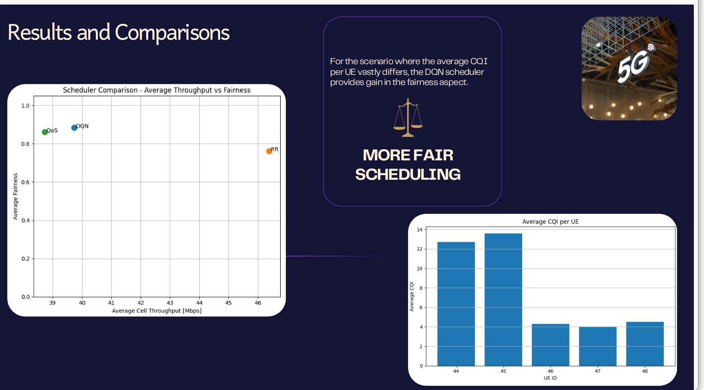
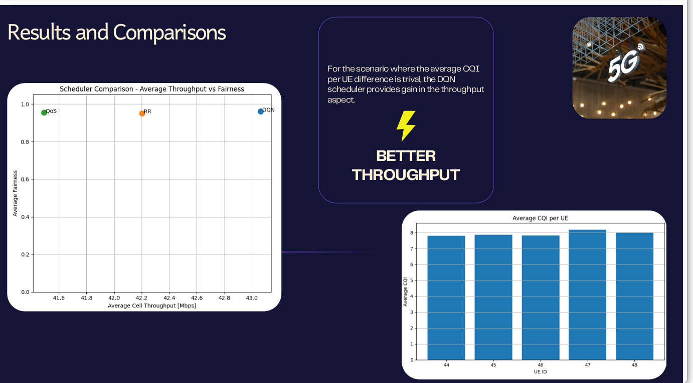

# 📡 AI-Driven RAN Scheduling & Monitoring Platform

This project presents an **AI-powered Radio Access Network (RAN) scheduling system** built on top of **srsRAN**, combined with a **real-time monitoring dashboard**.

It demonstrates how  Reinforcement Learning can be used to improve **resource allocation, fairness, and throughput** in 5G networks.

---

## 🚀 Project Overview

Modern 5G networks rely heavily on efficient scheduling of radio resources (PRBs). Traditional schedulers such as:

- Round Robin (RR)
- Proportional Fair (PF)
- Max-CQI

have limitations in dynamic environments.

👉 This project introduces an **AI-based scheduler** that learns optimal allocation strategies using data-driven approaches.

---

## 🧠 Key Features

- ✅ AI-based scheduler (Linear Regression + Reinforcement Learning)
- ✅ Integration with **srsRAN (5G stack)**
- ✅ YAML-driven configuration for flexible experimentation
- ✅ Real-time metrics collection (CQI, throughput, buffer, fairness)
- ✅ Interactive web dashboard for visualization
- ✅ Comparison with traditional schedulers (RR, PF)

---

## 🏗️ Project Structure

- 📁 **Oulun_Owls-Spring_Engineering_Challenge/**
  - Root directory of the project  

  - 📁 **srsRAN_Project/**
    - Modified 5G RAN stack  
    - Contains AI scheduler integration (DQN / ML)  

  - 📁 **ran_dashboard/**
    - Flask-based monitoring dashboard  
    - Visualizes throughput, fairness, and UE metrics  

  - 📁 **flexric/**
    - External RIC framework  
    - Reserved for O-RAN experiments  
---

## ⚙️ System Architecture

- **YAML Config (`testmode.yml`)**
  - Defines scheduler type and parameters  

- **Config Translator (DU Layer)**
  - Converts YAML → internal scheduler config  
 
- **Scheduler Factory**
  - Selects AI scheduler    

- **AI Scheduler (DQN / ML)**
  - Computes UE priorities   

- **PRB Allocation (srsRAN)**
  - Assigns radio resources  

- **Metrics → Dashboard**
  - Visualized via Flask app
    
---

## 🧩 xApp (Near-RT RIC Monitoring & Control)

This project integrates a **Near-Real-Time RAN Intelligent Controller (RIC)** using the **FlexRIC framework**, enabling external monitoring and control of the RAN.

### 📡 What is an xApp?

An **xApp** is a microservice running on the Near-RT RIC that:
- Subscribes to RAN metrics via the **E2 interface**
- Processes real-time data (e.g., CQI, throughput)
- Makes intelligent decisions or recommendations

👉 In this project, the xApp is used for:
- **Fairness monitoring**
- **Policy decision logging**
- **AI-RAN experimentation**

---

### 🧠 Implemented xApp: Fairness Monitor

- 📁 Location: flexric/examples/xApp/c/monitor/xapp_fairness_moni.c

- ⚙️ Functionality:
- Subscribes to **E2SM-KPM metrics** from the gNB
- Computes:
  - Raw Jain’s Fairness Index
  - Normalized Jain’s Index
  - Rolling mean and variance
  - Fairness delta (instability indicator)
- Detects:
  - Balanced state
  - Imbalance
  - Strong imbalance

---

## 🤖 AI Scheduler

The AI scheduler uses:

- 📊 Features:
  - CQI
  - Buffer size
  - Average throughput
  - Historical allocation

- 🎯 Output:
  - Scheduling priority per UE

- 🧠 Models:
  - Linear Regression (baseline)
  - Reinforcement Learning (DQN)

---

## 📊 Dashboard (ran_dashboard)

A Flask-based web app that provides:

- Real-time throughput visualization
- Fairness analysis (Jain’s Index)
- UE-level performance monitoring
- Scheduler comparison plots

---

##  📊 Results and Discussion

### 1️⃣ Scenario A: Heterogeneous CQI (Unequal Channel Conditions)

In this scenario, UEs experience significantly different channel qualities, as shown by the CQI distribution.

#### 🔍 Observations

- Round Robin (RR) achieves the highest throughput, but at the cost of fairness
- QoS scheduler maintains better fairness, but with lower throughput
- DQN scheduler (AI) achieves high fairness while maintaining competitive throughput

  <p align="center">
  
</p>

#### 🧠 Insight

👉 When CQI varies significantly, the DQN scheduler:

    - Prevents starvation of low-CQI users
    - Learns a balanced fairness-throughput tradeoff
    - Outperforms static policies

### 2️⃣ Scenario B: Homogeneous CQI (Similar Channel Conditions)

In this scenario, all UEs experience similar CQI values, meaning channel conditions are nearly uniform.

#### 🔍 Observations
  
    - DQN achieves the highest throughput
    - All schedulers maintain high fairness (~0.95+)
    - Differences arise mainly in efficiency (throughput)
    
<p align="center">
  
</p>
    
    
#### 🧠 Insight

👉 When CQI differences are small:
  
    - Fairness is naturally satisfied
    - The problem becomes throughput optimization

#### ➡️ The DQN scheduler:

Exploits small channel variations
Achieves better spectral efficiency

### ⚖️ Overall Takeaways

✅ AI adapts dynamically to network conditions

✅ Improves fairness in heterogeneous scenarios

✅ Maximizes throughput in homogeneous scenarios

✅ Outperforms RR and QoS schedulers

---

## 🛠️ Setup Instructions

### 1. Clone the repository

```bash
git clone https://github.com/C-3DevO/Oulun_Owls-Spring_Engineering_Challenge.git
cd Oulun_Owls-Spring_Engineering_Challenge

